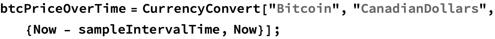
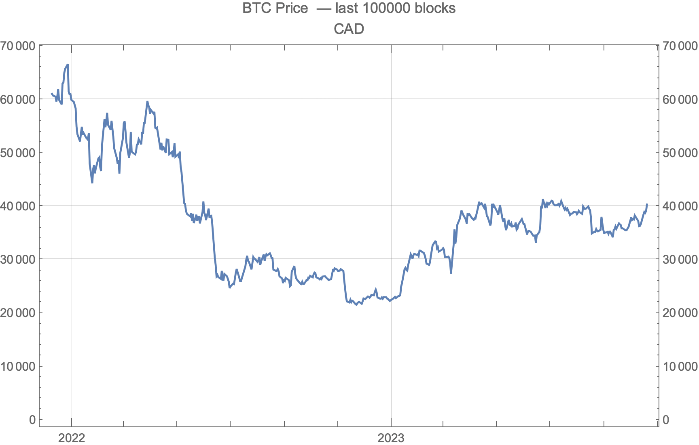
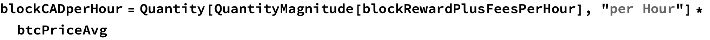
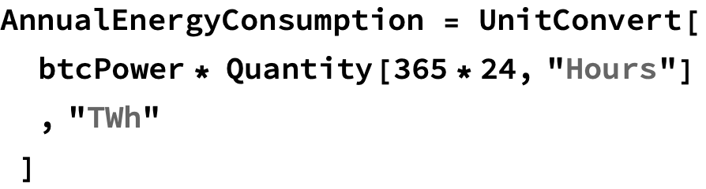
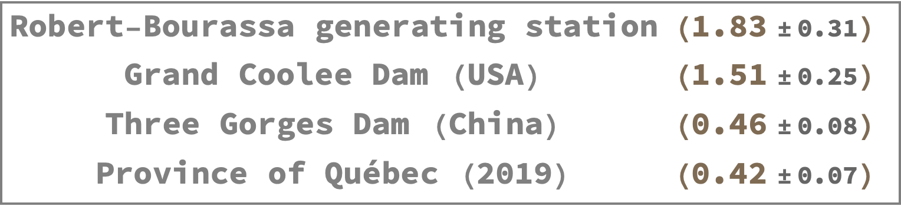
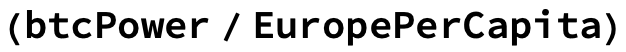

# Bitcoin Energy Estimates (DRAFT)

**Estimating the energy use of the Bitcoin network using two different approaches.**

 by Steven Black Project home: https://github.com/StevenBlack/bitcoin-energy-estimates Updated: October 22 2023

## Introduction

 Bitcoin mining uses a Proof-of-Work consensus mechanism. This is controversial for some people because that supposedly requires a lot of electrical energy. We see claims the bitcoin network &ldquo;uses as much electricity as a small country&rdquo;, or &ldquo;requires as much electricity as Belgium, or Chile.&rdquo;

 This Mathematica notebook assessed those notions using the following approaches: 

1. ***Presuming Bitcoin mining is marginally profitable, how much electical energy can be funded that balances actual mining rewards over time?***

1. ***Given the reported hashrate, how much energy would be required to achieve that?***

 This paper uses **Canadian dollars**, partly because that&rsquo;s my fiat currency, and because Canada publishes particularly good statistics about electricity generation and costs.

### Bitcoin price, block rewards, and fees

 Here we outline the major factors that play in the economics of Bitcoin mining.

#### The bitcoin price right now

 What is the current price of Bitcoin in Canadian dollars?

 

 

 

 

#### Bitcoin block rewards

 Bitcoin miners are compensated with the block reward from blocks they successfully mine, plus all the transaction fees in that block. In the current epoch (2020 - 2024) the block reward is 6 1/4 BTC.

 

 

#### Bitcoin transaction fees per block

 **ASSUMPTION**: the average of transaction fees per block is 0.15 BTC.

 

 

 Therefore, the total Bitcoin paid to miners for an average block, denominated in Bitcoin.

 

 

#### The actual block rate

 Historically Bitcoin blocks land at a rate faster then the block time target (6 per hour, or 144 blocks per day).&nbsp;&nbsp;Let's recon an average block rate over a sample interval to present day:

 

 

 

 

 

 

#### Total miner compensation, per hour

 

 

#### Bitcoin price in Canadian dollars as a time series

 Let's gather data on bitcoin price over the past sampleIntervalTime.

 

 Let's graph that bitcoin price over time.

 

 

 

#### Average bitcoin price over our sample time

 

 

## 1. Assuming mining is ecomomically marginal, how much electricity could be funded by mining rewards?

### Global revenue per hour

 The value, in Canadian Dollars, of all Bitcoin mined globally, per hour.

 

 

### Electricity cost, per kWh

 See: https://www.hydroquebec.com/business/customer-space/rates/comparison-electricity-prices.html

 

 Let&rsquo;s presume that nobody in their right mind would want to mine Bitcoin in New York or Boston. Here's the distribution of electricity input costs from the other 5 locations.

 

 

### Business cost assumption

 Let&rsquo;s presume 85% of mining revenue is available to pay electricity cost. The rest covers wages, maintenance, depreciation, and taxes.

 

 

### Energy economically sustainable

 

 

 Cognitively we can say, Bitcoin's power consumption is in the order of 10 GWH.

 

 

 Cognitively we can say, Bitcoin's annual energy consumption is in the order of 90 TWH.

### Comparisons with large power generation facilities or regions

 Let&rsquo;s compare the Bitcoin network with the power and energy that generated, or used, by various things.

 Here's the raw data for various generation facilities and regions.

 

 

 

## 2. Given the reported hashrate, how much energy would be required to achieve that?

 Coming soon.

## Appendix

### Robert-Bourassa generating station &mdash; a.k.a. &ldquo;LG-2&rdquo;

 Here we compare the power consumption of the bitcoin network with the power generation capacity of the Robert Bourassa generating station in the James Bay region of northern Qu&eacute;bec.  See https://en.wikipedia.org/wiki/Robert-Bourassa_generating_station

 

 

 What is Bitcoin&rsquo;s global energy use in terms of LG-2?

 

 

### Province of Qu&eacute;bec

 In 2019 the Province of Qu&eacute;bec produced 212.9 TWh of electricity.  What is Bitcoin&rsquo;s global energy use as a proportion of Qu&eacute;bec&rsquo;s electricity production in 2019?

 

 

 

 

 

 

### Province of Ontario

 See https://www.cer-rec.gc.ca/en/data-analysis/energy-markets/provincial-territorial-energy-profiles/provincial-territorial-energy-profiles-ontario.html

 In 2019, the average annual power consumption per capita in Ontario was 9.6 megawatt-hours (MWh).

 

 

 

 

### United States

 See https://www.worlddata.info/america/usa/energy-consumption.php

 

 

 

 

### Europe

 Again see See https://www.worlddata.info/america/usa/energy-consumption.php

 

 

 

 

 <a href="http://www.wolfram.com/language/" style="color:#000; text-decoration:none;">
  Created with the Wolfram Language 
 </a>

